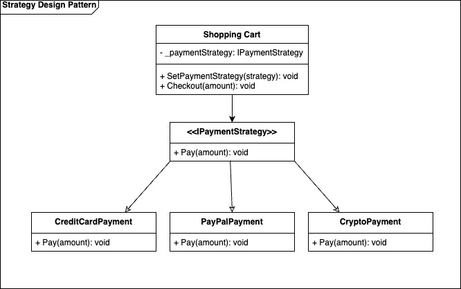
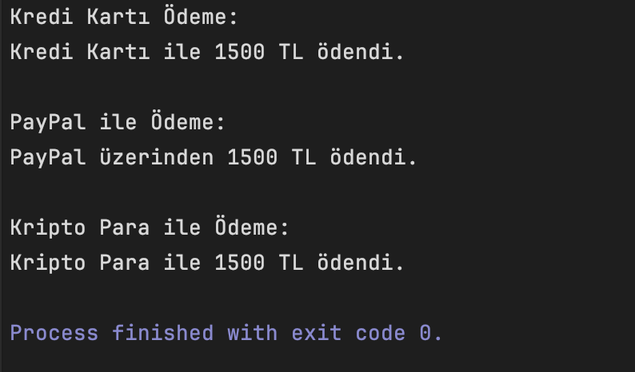

# Strategy Pattern - C#

## Overview

Strategy Design Pattern, davranışsal (behavioral) tasarım desenlerinden biridir ve bir nesnenin algoritmasını çalışma zamanında (runtime) değiştirmeyi sağlar. Bu desen, algoritmaları birbirinden bağımsız olarak tanımlar ve birbirlerinin yerine kullanılabilecek şekilde tasarlar. Bu sayede kodun esnekliği ve yeniden kullanılabilirliği artar.

## Benefits
- **Esneklik**: Mevcut kodu değiştirmeden kolayca yeni ödeme yöntemleri eklenebilir.
- **Ölçeklenebilirlik**: Yeni stratejileri zahmetsizce destekleyen genişletilebilir bir yapıdır.
- **Bakım Kolaylığı**: Her ödeme yöntemi izole edilmiştir, bu da minimum bağımlılık sağlar.

## UML Diagram


## Code Structure
- **IPaymentStrategy**: Ödeme yapma işleminin interface'ini tanımlar.
- **Concrete Strategies**: Çeşitli ödeme yöntemlerinin uygulanması (CreditCardPayment, PayPalPayment, CryptoPayment).
- **ShoppingCart**: Farklı ödeme stratejileriyle etkileşime giren Context Class.

## Example Usage
```csharp
var cart = new ShoppingCart();
decimal totalAmount = 1500m;

// Credit Card Payment
cart.SetPaymentStrategy(new CreditCardPayment());
cart.Checkout(totalAmount);

// PayPal Payment
cart.SetPaymentStrategy(new PayPalPayment());
cart.Checkout(totalAmount);

// Crypto Payment
cart.SetPaymentStrategy(new CryptoPayment());
cart.Checkout(totalAmount);
```

## Output
