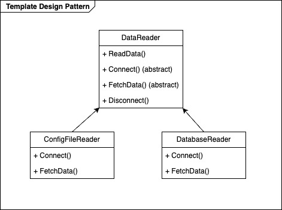
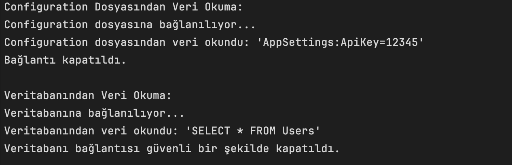

# Template Design Pattern - C#

## Overview
**Template Design Pattern**, bir algoritmanın ana yapısını (iskeletini) tanımlayan ve belirli adımların alt sınıflar tarafından özelleştirilmesine olanak tanıyan bir davranışsal (behavioral) tasarım desenidir.  
Bu desen, algoritmanın ortak adımlarını üst sınıfta tanımlar ve özelleştirilmesi gereken adımları alt sınıflara bırakır.

## Benefits
- Kod tekrarını azaltmak
- Genel algoritmanın iskeletini korumak
- Alt sınıflara özelleştirme esnekliği sağlamak

---

## UML Diagram


## Example
Bu projede, farklı veri kaynaklarından (Configuration Dosyası ve Veritabanı) veri okuma işlemini **Template Design Pattern** ile ele alıyoruz.

### Senaryo:
1. Farklı kaynaklardan veri okunması gerekiyor:
    - **Configuration dosyası**: Uygulama ayarlarının okunması
    - **Veritabanı**: SQL sorguları ile veri çekilmesi
2. Her iki işlem de aynı genel adımları içerir:
    - **Bağlantı kurma**
    - **Veriyi okuma**
    - **Bağlantıyı kapatma**
3. Ancak, bu adımların içeriği veri kaynağına göre değişir.

---

## Code Structure
- **`DataReader`**:  
  Abstract sınıf. Veri okuma işleminin ana iskeletini tanımlar (`ReadData()` metodu). Alt sınıfların `Connect()` ve `FetchData()` metodlarını uygulaması beklenir.

- **`ConfigFileReader`**:  
  Configuration dosyasından veri okumayı gerçekleştiren sınıf.

- **`DatabaseReader`**:  
  Veritabanından veri okumayı gerçekleştiren sınıf.

---

## Example Usage
```csharp

Console.WriteLine("Configuration Dosyasından Veri Okuma:");
DataReader configReader = new ConfigFileReader();
configReader.ReadData();

Console.WriteLine("\nVeritabanından Veri Okuma:");
DataReader dbReader = new DatabaseReader();
dbReader.ReadData();
```

## Output
